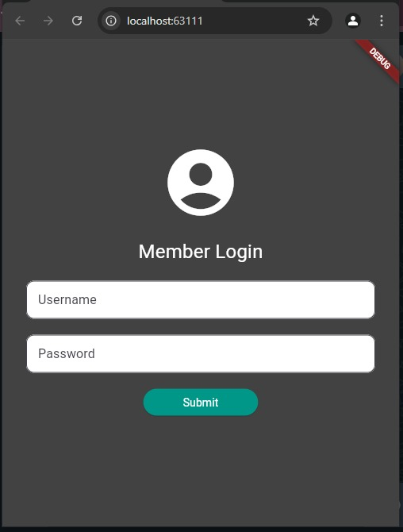
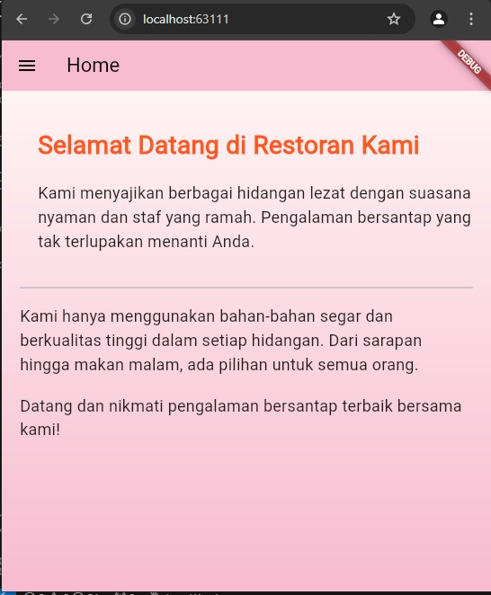
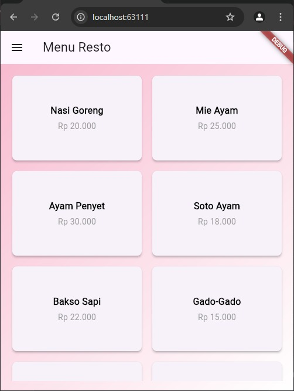
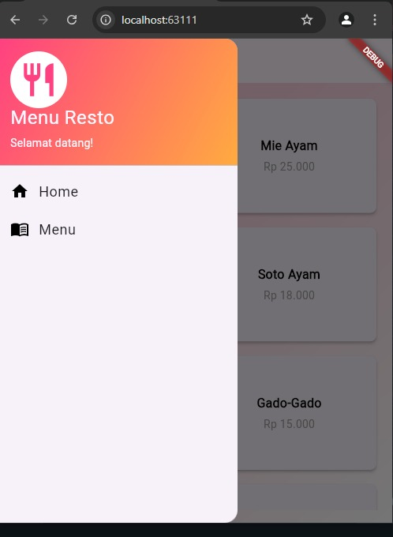

LabMobile3_SOLANI_Shift-C  
Praktikum Pemrograman Mobile  

Nama   : SOLANI  
NIM    : H1D022033  
Shift  : C  

Aplikasi ini adalah aplikasi restoran yang menyediakan login, halaman beranda(home), menu, dan sidemenu. Setelah pengguna berhasil login,maka dapat mengakses berbagai fitur aplikasi.

1. Login Page  

   - Tujuan: Halaman ini digunakan untuk autentikasi pengguna sebelum dapat mengakses fitur aplikasi.  
   - Komponen Utama:  
     - TextEditingController: Kontrol untuk menangani input dari pengguna (username dan password).  
     - _saveUsername(): Metode yang menyimpan username ke SharedPreferences setelah login berhasil, sehingga username tetap tersimpan meskipun aplikasi ditutup.  
     - _showDialog(): Digunakan untuk menampilkan pesan dialog setelah login, apakah berhasil atau gagal.  
     - Icon & Form: Menampilkan ikon pengguna dan dua input field untuk username dan password.  
     - Tombol Submit: Mengarahkan pengguna ke halaman HomePage jika login berhasil, atau menampilkan pesan kesalahan jika login gagal.  

   Screenshot :  
   - Tampilan login page dengan ikon, form input, dan tombol submit. 
   -  
  
2. Home Page  

   - Tujuan: Halaman beranda yang muncul ketika pengguna setelah login berhasil dan memberikan informasi tentang restoran.  
   - Komponen Utama:  
     - AppBar: Bilah di bagian atas halaman yang berisi judul "Home" dan ikon menu samping (drawer).  
     - Drawer (Side Menu): Menu samping yang bisa dibuka melalui ikon di AppBar untuk navigasi ke halaman lain.  
     - Body: Teks sambutan dan informasi mengenai restoran yang diatur menggunakan widget Column dan Padding agar tampak rapi dan terstruktur.  
   
   Screenshot yang Direkomendasikan:  
   - Tampilan halaman beranda yang memuat teks sambutan dan deskripsi restoran. 
   -    

3. Menu Page  
 
   - Tujuan: Halaman akan menampilkan daftar menu restoran kepada pengguna.  
   - Komponen Utama (opsional):  
     - ListView atau GridView: Untuk menampilkan daftar menu makanan secara dinamis, baik dalam bentuk list atau grid.  
     - Card Widget: Untuk menampilkan setiap item menu dengan nama hidangan, deskripsi, dan gambar.  
   
   Screenshot yang Direkomendasikan:  
   - Tampilan daftar menu dengan gambar, deskripsi, dan harga (jika sudah diimplementasikan). 
   -    

4. Side Menu (Sidemenu)  
 
   - Tujuan: Menu navigasi samping yang memungkinkan pengguna berpindah dari satu halaman ke halaman lain, seperti Home Page atau Menu Page.  
   - Komponen Utama:  
     - Drawer: Komponen menu samping yang dibuka dari ikon di AppBar.  
     - ListTile: Setiap opsi di menu samping (seperti "Home" dan "Menu") menggunakan ListTile untuk menampilkan teks dan ikon.  
     - Navigator: Mengelola perpindahan antar halaman ketika pengguna memilih opsi dari menu samping.  
   
   Screenshot yang Direkomendasikan:  
   - Tampilan drawer atau menu samping ketika dibuka, dengan daftar opsi navigasi seperti "Home" dan "Menu".
   -     

---

